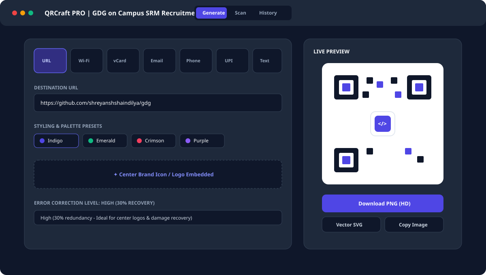
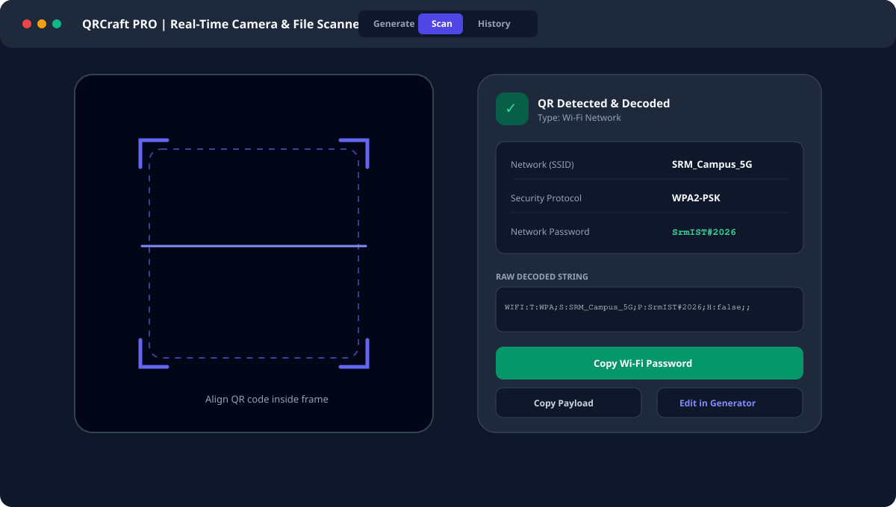

# QRCraft PRO — Modern QR Code Studio & Scanner

[](https://react.dev)
[](https://www.typescriptlang.org)
[](https://vitejs.dev)
[](https://tailwindcss.com)
[](https://vercel.com)

A high-performance, client-side web application built for the **Google Developer Groups (GDG) on Campus SRM Technical Domain Recruitment 2026**.

**Live Demo:** [https://gdg-qrcraft.vercel.app](https://gdg-qrcraft.vercel.app) *(or your deployed Vercel URL)*  
**Repository:** [https://github.com/shreyanshshaindilya/gdg](https://github.com/shreyanshshaindilya/gdg)

---

## Visual Previews

### 1. Custom QR Code Studio (Generator Mode)


### 2. Real-Time Camera Scanner & Smart Decoded Actions


---

## Key Features

### 1. Dynamic QR Code Generator
- **Multiple Payload Types Supported:**
  - **Website / URL**: Automatically formats destination endpoints with validation.
  - **Plain Text / Notes**: Freeform multi-line text encoding with character count.
  - **Wi-Fi Network**: Standard ZXing Wi-Fi format (`WIFI:T:...;S:...;P:...;H:...;;`), supporting WPA/WPA2/WPA3, WEP, open networks, and hidden SSIDs.
  - **vCard 3.0 Contact Card**: RFC 6350 compliance for instant contact creation on smartphones (Name, Company, Title, Phone, Email, Website, Address).
  - **Email**: Pre-filled mailto links with subject and message body.
  - **Phone / SMS**: Direct dialing or pre-filled SMS messages.
  - **UPI Payments**: Standard Indian unified payments interface link (`upi://pay?pa=...&pn=...&am=...`), compatible with GPay, PhonePe, Paytm, and BHIM.
- **Deep Visual Customization:**
  - One-click modern color presets or granular hex color pickers for foreground modules and background.
  - Transparent background export toggle.
  - Reed-Solomon Error Correction Level selector: **L** (7%), **M** (15%), **Q** (25%), **H** (30%).
  - Adjustable quiet zone / margin sliders.
  - Custom brand logo / image upload centered with rounded safety badge and automatic error tolerance adjustment.
- **Flexible Exporting:**
  - High-resolution PNG downloads (512px, 1024px HD, 2048px Print-ready).
  - Scalable Vector Graphics (SVG) export.
  - Direct image copy to clipboard (`navigator.clipboard`).
  - Native Web Share API integration on supported mobile devices.

### 2. High-Precision QR Scanner
- **Live Video Camera Scanner:**
  - Real-time video frame decoding via `html5-qrcode`.
  - Device camera switching (Front facing / Rear environment camera).
  - Built-in flashlight / torch toggle (where supported by hardware).
  - Animated optical scanning laser with viewfinder framing brackets.
  - Audio feedback beep on successful detection.
- **Image File Drag-and-Drop & Clipboard Paste:**
  - Drag and drop image files directly onto the dropzone.
  - System clipboard paste listener (`Ctrl + V`) to scan screenshots immediately without saving files.
- **Smart Parsed Actions:**
  - Intelligent parser categorizes decoded strings into URLs, Wi-Fi networks, vCards, UPI transactions, or plain text.
  - Quick action buttons: **Open Link in New Tab**, **Copy Wi-Fi Password**, **Copy Payload**, and **Send to Generator** to re-edit.

### 3. Local History & Offline Persistence
- Persists all generated and scanned QR codes in `localStorage`.
- Real-time search filter and category filtering (All, Generated, Scanned).
- One-click JSON export for data backups.
- Complete client-side privacy: Zero payloads or photos are transmitted to external servers.

### 4. UI / UX Design
- Built with Tailwind CSS and Lucide React icons.
- Fully responsive across desktop monitors, tablets, and smartphones.
- Dark / Light theme toggle with system preference detection and localStorage persistence.

---

## Architecture & Design Decisions

```
src/
├── types.ts                     # Strict TypeScript interfaces & payload models
├── index.css                    # Tailwind CSS directives & scanning animations
├── main.tsx                     # React 18 DOM root initialization
├── App.tsx                      # Layout container, active tab state & toasts
├── utils/
│   ├── qrPayloads.ts            # Industry-standard string formatters (WIFI, vCard, UPI)
│   ├── qrParser.ts              # Payload tokenizer and pattern recognizer
│   ├── canvasExport.ts          # Off-screen canvas rendering, logo blending, SVG & PNG exports
│   └── storage.ts               # LocalStorage abstraction with versioning
└── components/
    ├── Navbar.tsx               # Top navigation, brand badge, theme & repo links
    ├── Toast.tsx                # Floating feedback notification system
    ├── generator/
    │   ├── TypeSelector.tsx     # Categorical QR type selector grid
    │   ├── PayloadForms.tsx     # Contextual inputs corresponding to each type
    │   ├── DesignCustomizer.tsx # Color presets, error correction & logo uploader
    │   ├── QRPreview.tsx        # Live canvas display, resolution switcher & downloads
    │   └── QRGenerator.tsx      # Generator orchestrator component
    ├── scanner/
    │   ├── CameraScanner.tsx    # Hardware camera access, torch control & viewfinder
    │   ├── FileScanner.tsx      # File drag-and-drop & clipboard paste handler
    │   ├── ScanResultCard.tsx   # Structured output card with smart action triggers
    │   └── QRScanner.tsx        # Scanner orchestrator component
    └── history/
        └── QRHistory.tsx        # Searchable record of generated & scanned items
```

### Why This Stack?
1. **React 18 + Vite**: Instant hot-module replacement in development, fast build output, and optimized vendor chunk splitting.
2. **TypeScript**: Strong typing across payloads (vCard, WiFi, UPI) prevents runtime bugs and ensures robust data handling.
3. **HTML5-QRCode & QRCode**: Industry standards for barcode detection and canvas rendering, optimized for cross-browser reliability.
4. **Tailwind CSS**: Utility-first styling enabling dark mode and mobile-responsive layouts.

---

## Local Setup & Installation

### Prerequisites
- [Node.js](https://nodejs.org) (v18.0.0 or higher recommended)
- `npm` or `yarn` or `pnpm`

### Installation Steps

1. **Clone the repository:**
   ```bash
   git clone https://github.com/shreyanshshaindilya/gdg.git
   cd gdg
   ```

2. **Install dependencies:**
   ```bash
   npm install
   ```

3. **Start the local development server:**
   ```bash
   npm run dev
   ```
   Open your browser and navigate to `http://localhost:3000`.

4. **Build for production:**
   ```bash
   npm run build
   ```
   The compiled static assets will be output to the `dist/` directory.

5. **Preview the production build locally:**
   ```bash
   npm run preview
   ```

---

## Deployment on Vercel

The project is pre-configured for one-click deployment on [Vercel](https://vercel.com).

### Option A: Via Vercel Web Dashboard (Recommended)
1. Push your repository to GitHub: `https://github.com/shreyanshshaindilya/gdg`.
2. Go to [vercel.com](https://vercel.com) and log in.
3. Click **"Add New Project"** and import the `gdg` repository.
4. Framework Preset will automatically detect **Vite**.
5. Click **"Deploy"**. Vercel will build and assign a production URL.

### Option B: Via Vercel CLI
```bash
npm install -g vercel
vercel login
vercel
vercel --prod
```

`vercel.json` is included in the project root to handle client-side routing rewrites and security response headers.

---

## Security & Privacy Note
- All QR code generation and image recognition execute **100% locally in the client browser**.
- No camera frames, uploaded images, or contact payloads are transmitted to any backend server.
- The repository follows security standards: `.env` and sensitive configurations are ignored in `.gitignore`.

---

## Candidate Information
- **Applicant:** Shreyansh Shaindilya
- **Domain:** Technical Domain (Frontend / Web Development)
- **Recruitment:** GDG on Campus, SRM Institute of Science and Technology (Recruitments 2026)
- **Email:** shreyanshshaindilya09@gmail.com
- **Repository:** [https://github.com/shreyanshshaindilya/gdg](https://github.com/shreyanshshaindilya/gdg)
